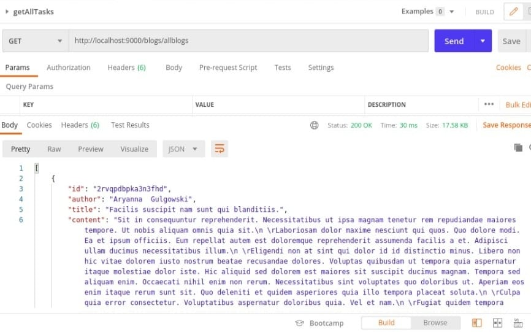
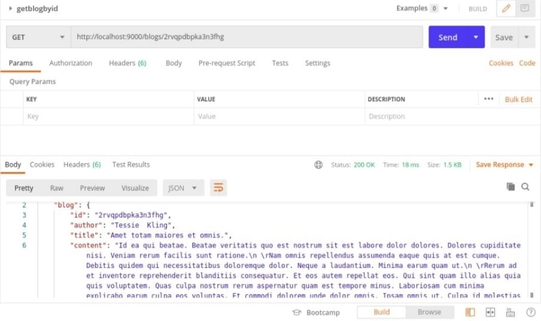
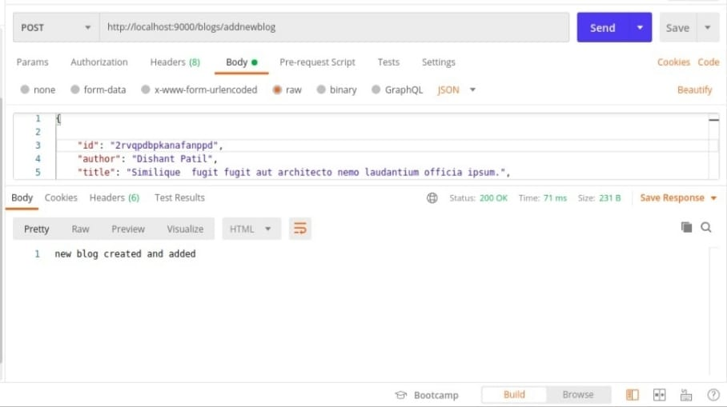

# Blog Backend

**Blog Backend** is a project which will handle the backend of blog it has express routes for diffrent files from local json data based on route path and request we have created three router one route to get all blogs one route to get blogs by id of blog and create a new blog

# Content

- **app.js** this is the file in which we are creating express server and listening the server and we have imported routes in itt and use routes

- **routes** this folder contains file - **blogroute.js** which has the Router all the routes for getting a blog or adding a posting blog a blog to file
- **controller** in this folder we have **blogcontroller.js** in which we have all the middle ware for processing the routes which are then exported and and used in routes
- **data** this folder contain **blogData.json** in which all the file read wirte operations are performed and data is stored

# DEMO

**get all blog**

**get blog by id**

**add new blog to file**

